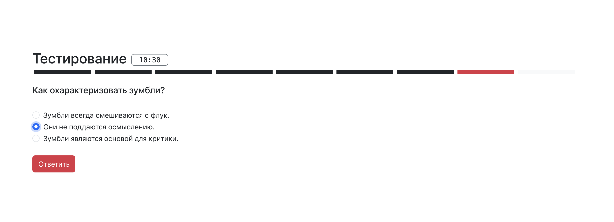

<h1 align="center">Информационная система для проверки знаний учащихся школы</h1>

<a href='https://github.com/azemcov/REACT-TEST/'>👉 ОТКРЫТЬ 👈</a>

## 📖 Описание

Информационная система для проверки знаний учащихся школы.

Включает виды тестов:

- выбор одного варианта
- выбор нескольких вариантов
- короткий ответ
- развернутый ответ

Тест имеет ограничение по времени выполнения.
При перезагрузке страницы сохраняутся прогресс выполнения.

## 🔥 Обновления

- **`ноябрь 1, 2024`**: Версия 1.0

## ⚙️ Использованные технологии

<a href="https://developer.mozilla.org/en-US/docs/Web/JavaScript"> </img> </a>
<a href="https://www.typescriptlang.org/"> </img></a>
<a href="https://react.dev/"> </img></a>
<a href="https://html.spec.whatwg.org/multipage/"> </img></a>
<a href="https://www.w3.org/Style/CSS/Overview.en.html"> </img></a>
<a href="https://getbootstrap.com/"> </img></a>
<a href="https://v2.vitejs.dev/"> </img></a>
